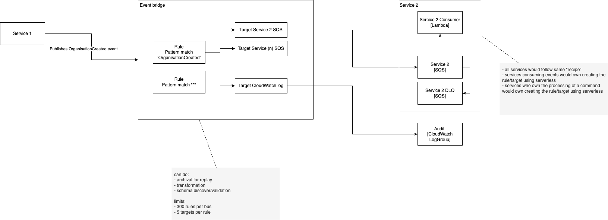

Hi!

This experiment is to show how we can use event bridge to integration different services through messages (Events & Commands)

For Events:
- Any service can publish interesting Events eg. OrganisatonCreated
- Any service can add a rule & target to themselves to process only Events they care about
- Services pull events onto a queue for processing to add a layer of resiliance. This includes a dead-letter-queue for handling error scenarios

For Commands:
- Any service can send a Command to the bus eg. SendNotification
- Commands are owned by a single service - the owner
- Only the owner should create a rule & target to process the Command
- As before the services pulls the Command onto a queue for processing with a dlq

Todo:
- error handling at the bus level
- archiving of bus messages for replay (if necessary)
- schema validation & discovery
- CW dashboards for queue metrics & alerting
- auditing resources should be seperate from any single service (it's cross cutting)

